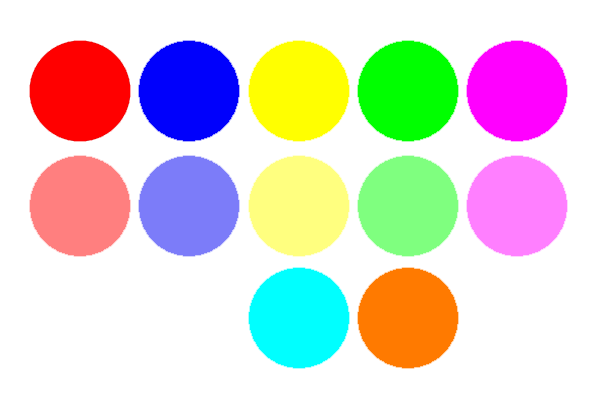

# GIP-2022-2023

### :star2: Over Ons Project
Welkom bij ons dambord project. Ons doel is om het klassieke damspel naar het digitale tijdperk te brengen met dit geavanceerde ontwerp. Het bord wordt bestuurd door twee joysticks, waardoor spelers een interactieve spelervaring krijgen. Bovendien hebben spelers toegang tot, en controle over het bord via een gebruiksvriendelijke webinterface, waardoor het voor iedereen gemakkelijk is om het spel te overzien. De LED-lampjes, die zowel de stukken als het bord verlichten, voegen een vleugje hightech verfijning toe aan het spel en spelers kunnen hun ervaring aanpassen met verschillende kleuropties. Met zijn innovatieve ontwerp en geavanceerde technologie belooft ons LED Checkers Board bestuurd door joysticks en een webinterface een game-changer te worden in de wereld van checkers. Maak je klaar om je damspel naar een hoger niveau te tillen!

### :dart: Onderdelen
- local: Progamma van het dambord en de lokale website
- server: Progamma van de server
- website: Root van de [website](https://dambord.netlify.app/)

### :camera: Dambord

 
  

### :camera: Kleuren

 
  

